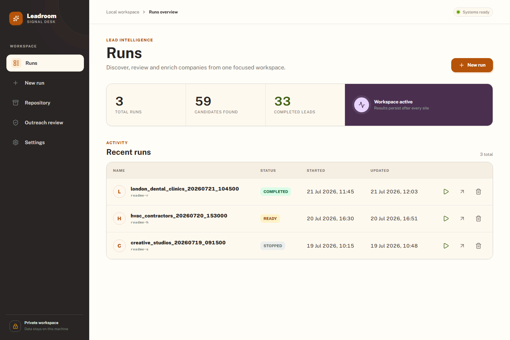
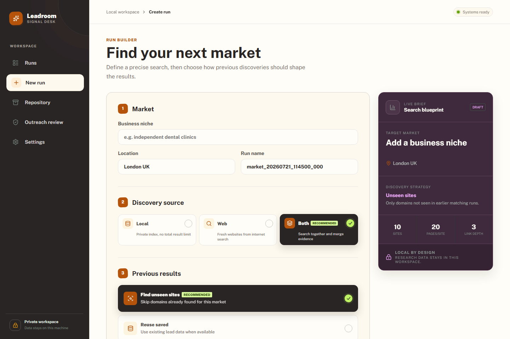
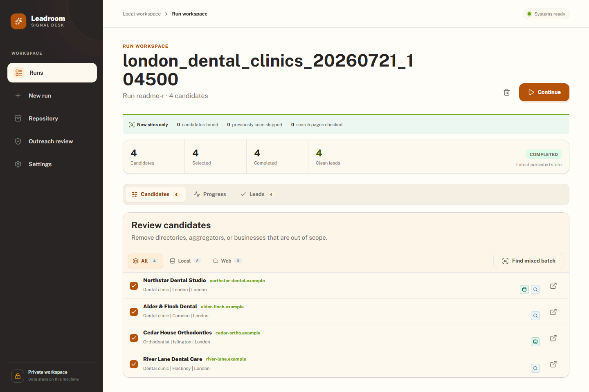
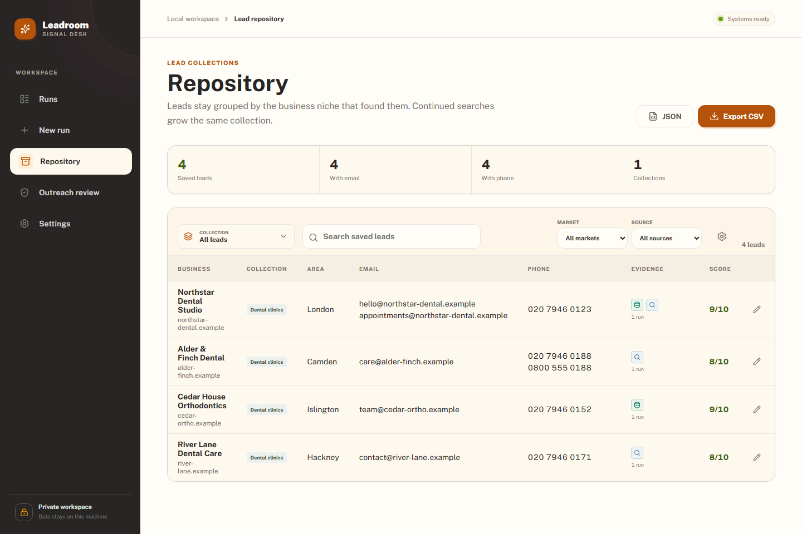
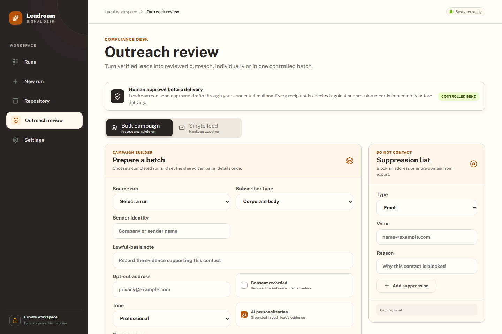
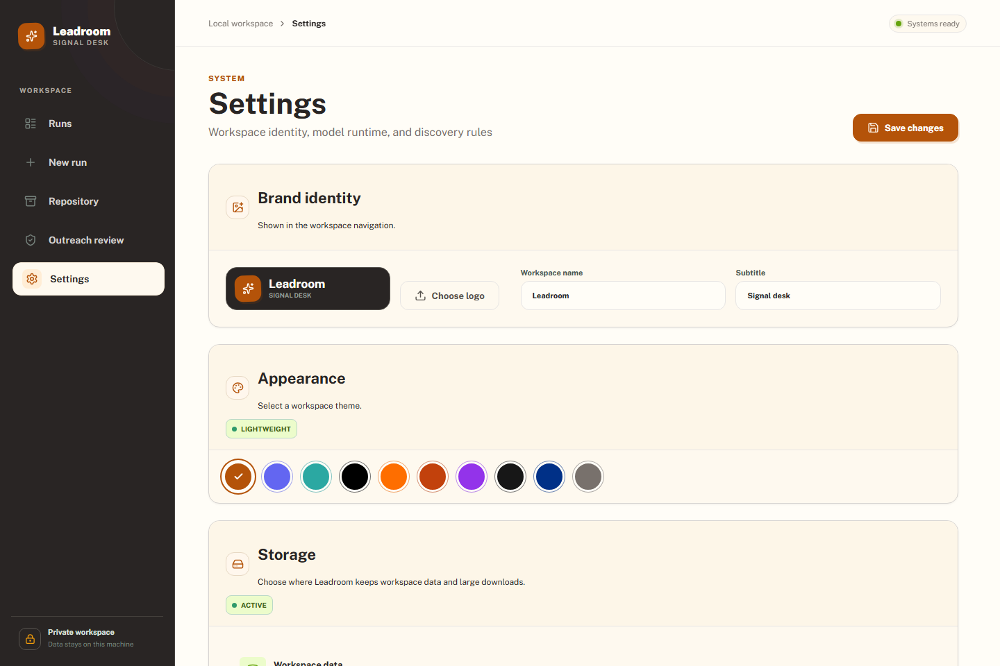

<div align="center">
  
  <h1>Leadroom</h1>
  <p><strong>Local-first lead discovery, enrichment, repository, and reviewed outreach for Windows.</strong></p>
  <p>
    
    
    
    
  </p>
</div>

Leadroom turns a business niche and location into a reviewable set of public business contacts. It combines live web discovery with an optional private OpenStreetMap index, crawls business sites at configurable depth, enriches results with a local or OpenAI-compatible model, and merges useful leads into a deduplicated repository.

Everything runs on the user's computer by default. Web discovery and website crawling still contact internet services; "local-first" does not mean every workflow is offline.

Leadroom is created by [Borun Studios Ltd](https://borunstudios.co.uk/), London, United Kingdom. If you use, adapt, showcase, or write about the project publicly, please credit Borun Studios Ltd and include a link to the studio website.

> **AI authorship:** All application code in this repository was written by AI under human direction, product decision-making, testing, and review.

> **Pre-release:** the source app and Windows executable build work today. A guided installer and clean-machine release pipeline are planned in [RELEASE.md](RELEASE.md). Public binary releases remain blocked pending the dependency review recorded in [docs/DEPENDENCY_LICENSES.md](docs/DEPENDENCY_LICENSES.md).

## Screenshots

These screenshots are generated by Playwright from fictional `.example` data. They contain no real leads, accounts, API keys, or user paths.



<table>
  <tr>
    <td width="50%"></td>
    <td width="50%"></td>
  </tr>
  <tr><td align="center"><strong>Run builder</strong></td><td align="center"><strong>Candidate review</strong></td></tr>
  <tr>
    <td></td>
    <td></td>
  </tr>
  <tr><td align="center"><strong>Deduplicated repository</strong></td><td align="center"><strong>Controlled outreach</strong></td></tr>
</table>



## Features

- **Repeatable discovery:** search the web, a private local index, or both; continue one run without revisiting market domains already found.
- **Candidate review:** separate local/web evidence, remove directories or off-target sites, and select candidates for enrichment.
- **Deep crawling:** Quick, Deep, and Exhaustive modes inspect priority pages, same-domain links, `robots.txt`, and sitemaps with bounded limits.
- **Contact enrichment:** deterministic HTML/JSON-LD extraction plus ScrapeGraphAI; up to three normalized, deduplicated emails and phone numbers.
- **Persistent jobs:** progress, failure, retry, stop, continuation cursors, diagnostics, and per-site crawl state in SQLite.
- **Unified repository:** merge businesses by domain, manage collections, edit/move/delete records, and export timestamped CSV or JSON.
- **Model manager:** detect, download, select, and benchmark Ollama models, or use an OpenAI-compatible endpoint.
- **Controlled outreach:** bulk AI-assisted drafts, evidence and consent fields, suppression, human approval, and SMTP delivery.
- **Custom workspace:** name, subtitle, logo, ten lightweight themes, discovery blocklists, storage folders, model, and email accounts.
- **Native desktop shell:** a dedicated WebView2 window, single-instance lock, and clean local-API shutdown.

## Project Origin

Leadroom began as a local lead-scraping prototype built around [`SmartScraperGraph`](https://github.com/ScrapeGraphAI/Scrapegraph-ai) from the open-source **ScrapeGraphAI** project. ScrapeGraphAI remains the LLM-assisted extraction engine used in `app/scraper.py`.

The discovery orchestration, OSM index, persistence layer, React workspace, repository, desktop runtime, model manager, and outreach controls are Leadroom-specific. Leadroom is an independent project created by Borun Studios Ltd and is not an official ScrapeGraphAI product or endorsed by its maintainers.

See [NOTICE.md](NOTICE.md) for project authorship and attribution, and [THIRD_PARTY_NOTICES.md](THIRD_PARTY_NOTICES.md) for upstream and data-source attribution.

## Requirements

Standard source setup:

- Windows 10/11, 64-bit
- Python 3.12 or 3.13
- Node.js 22+
- [Ollama](https://ollama.com/) for the default local-model workflow
- Microsoft Edge WebView2 Runtime for the native desktop window

Optional full local discovery additionally needs WSL2/Ubuntu, PostgreSQL, PostGIS, `osm2pgsql`, roughly 2 GB for the Great Britain PBF, and about 25 GB for an updateable imported database. Web-only discovery does not need this stack.

An OpenAI-compatible endpoint can replace Ollama, but may have external cost and data-processing implications.

## Install From Source

```powershell
git clone https://github.com/bayonsa/Leadroom.git
cd Leadroom

python -m venv .venv
.\.venv\Scripts\Activate.ps1
python -m pip install --upgrade pip
python -m pip install -r requirements-dev.txt
npm ci --prefix frontend

ollama pull llama3.2:3b
python -m app.preflight
```

Defaults work without a `.env` file. To override them, copy `.env.example` to `.env`. Never commit `.env`, databases, exports, logs, or model files.

## Run

Native desktop window:

```powershell
.\.venv\Scripts\python.exe run_desktop.py
```

Browser development mode, in two terminals:

```powershell
.\.venv\Scripts\python.exe run_api.py
```

```powershell
npm run dev --prefix frontend
```

Open `http://127.0.0.1:5173`. FastAPI docs are at `http://127.0.0.1:8000/docs` in development mode.

CLI:

```powershell
.\.venv\Scripts\python.exe run_cli.py `
  --niche "independent dental clinics" `
  --location "London UK" `
  --max-sites 10
```

CLI exports default to `data/exports/`. The desktop workspace provides the wider local/hybrid discovery, deep-crawl, repository, model-management, and outreach workflows.

## Workflow

1. Create a run with a niche, location, source, previous-result policy, and crawl depth.
2. Remove directories, aggregators, and businesses outside the target market.
3. Start enrichment and inspect evidence, per-site progress, errors, and clean leads.
4. Continue local or web discovery from the same run when another batch is needed.
5. Save contactable leads to the Repository; repeated domains merge.
6. Export CSV/JSON or prepare a reviewed outreach batch.

## Discovery and Crawling

| Source | Behaviour |
|---|---|
| Web | DDGS by default, or Brave when configured; paginated results and directory filtering. |
| Local | Optional PostgreSQL/PostGIS OSM index with no search-API result limit. |
| Both | Concurrent local/web discovery, alternating source results and merging domains. |

`Find unseen sites` is market-scoped: Leadroom normalizes niche/location, remembers prior domains, and advances each source cursor independently. `Reuse saved` consumes prior data when available; `Recheck every site` refreshes returned domains.

| Crawl mode | Pages | Depth | Use |
|---|---:|---:|---|
| Quick | 6 | 2 | Fast first pass |
| Deep | 20 | 3 | Default balanced research |
| Exhaustive | 40 | 4 | Difficult sites requiring broader internal traversal |

The crawler remains on the candidate domain, prioritizes contact/about/service/location pages, and can traverse sitemap indexes. It does not bypass authentication, paywalls, or access controls.

## Models

The default model is `ollama/llama3.2:3b`. **Settings > Model runtime** can list installed Ollama models, search/download variants, select the active model, run a structured extraction benchmark, or configure an OpenAI-compatible endpoint and key.

A passing benchmark is a compatibility signal, not a guarantee that every website will extract correctly.

## Email and Outreach

Leadroom sends only drafts that pass application controls:

- generic public business mailbox, source evidence, minimum score, and subscriber classification;
- lawful-basis or recorded-consent fields where applicable;
- suppression checks during drafting, approval, and immediately before delivery;
- named reviewer, corporate-status confirmation, and privacy-notice confirmation;
- one active send job and at most 25 sent messages per rolling 24 hours;
- stop-after-current-message and an `uncertain` state when SMTP acceptance cannot be reconciled.

SMTP accounts support STARTTLS or SSL/TLS. Many mailboxes displayed in Outlook require the email provider's SMTP hostname and an app password. Leadroom does not currently automate the Outlook desktop client or Microsoft Graph OAuth.

Read [COMPLIANCE.md](COMPLIANCE.md) before real-world use. These controls are not legal advice; operators remain responsible for consent, lawful basis, transparency, content, and applicable law.

## Storage and Security

The packaged app keeps bootstrap files under `%LOCALAPPDATA%\Leadroom`. **Settings > Storage** can place workspace data and large downloads on separate drives. Changes apply after restart; changing the Ollama model folder also requires restarting Ollama.

Backup and restore while Leadroom is stopped:

```powershell
.\.venv\Scripts\python.exe -m app.data_management backup D:\Backups\leadroom.db
.\.venv\Scripts\python.exe -m app.data_management restore D:\Backups\leadroom.db
```

Security boundaries:

- The desktop API binds to `127.0.0.1` and uses a per-launch token for the bundled UI.
- Model keys, SMTP passwords, and account secrets on Windows are protected with the current user's DPAPI credentials.
- Settings APIs return configured flags, not stored secrets.
- Linux/macOS source runs do not have Windows DPAPI protection and are not supported release targets.
- Automated screenshots/tests use reserved fake domains and accounts.

Report vulnerabilities through GitHub private vulnerability reporting as described in [SECURITY.md](SECURITY.md).

## Optional OpenStreetMap Index

```powershell
.\scripts\setup-local-data.ps1
.\scripts\import-osm.ps1
```

The import defaults to `D:\LeadroomData\osm`, creates a Great Britain index, and configures incremental update scripts. Review the scripts and storage requirements first; this remains a heavyweight developer setup.

```powershell
wsl -d Ubuntu -u root -- systemctl status leadroom-osm-update.timer
wsl -d Ubuntu -u root -- journalctl -u leadroom-osm-update.service --no-pager
```

OpenStreetMap data is © OpenStreetMap contributors and available under the ODbL. See [THIRD_PARTY_NOTICES.md](THIRD_PARTY_NOTICES.md).

## Build

```powershell
.\scripts\package.ps1
```

The one-file result is `dist\Leadroom.exe`. It does not bundle Ollama models or the optional OSM dataset.

To build the local Windows installer, portable archive, and SHA-256 checksums:

```powershell
.\scripts\build-release.ps1 -Version 0.1.0
```

The installer offers Standard and Full Local modes, separate folders for workspace data and large downloads, and optional WebView2, Ollama, model, and OpenStreetMap setup. See [docs/PACKAGING.md](docs/PACKAGING.md). These artifacts remain local release candidates and must not be uploaded publicly until the blockers in [RELEASE.md](RELEASE.md) are complete.

## Tests

```powershell
.\scripts\check.ps1
```

Or run layers individually:

```powershell
.\.venv\Scripts\python.exe -m pytest
.\.venv\Scripts\python.exe -m ruff check app tests run_cli.py run_api.py
npm run lint --prefix frontend
npm test --prefix frontend
npm run build --prefix frontend
npm run test:e2e --prefix frontend
```

Regenerate the privacy-safe README images while Vite is running:

```powershell
Push-Location frontend
npx playwright test e2e/readme-screenshots.spec.ts --project=desktop --workers=1
Pop-Location
```

See [TEST_STRATEGY.md](TEST_STRATEGY.md) for test layers and performance budgets.

## Architecture

```text
React + TypeScript
        |
FastAPI localhost API ---> SQLite runs/repository/compliance
        |
        +-- DDGS / optional Brave web discovery
        +-- optional PostgreSQL + PostGIS + OSM discovery
        +-- bounded crawl + deterministic extraction
        +-- ScrapeGraphAI + Ollama/OpenAI-compatible model
        +-- SMTP after compliance approval
```

Key modules:

- `app/api.py` - API and background jobs
- `app/search.py`, `app/search_providers.py` - discovery and continuation
- `app/local_data.py`, `infra/osm/` - private OSM index
- `app/enrichment.py`, `app/scraper.py` - crawling, contacts, and ScrapeGraphAI
- `app/database.py` - runs, repository merging, settings, and migrations
- `app/compliance.py`, `app/outreach_ai.py`, `app/email_delivery.py` - reviewed outreach
- `app/storage.py`, `app/secrets.py` - data roots and Windows DPAPI
- `run_desktop.py` - WebView2 desktop lifecycle
- `frontend/` - React 19, TypeScript, TanStack Query/Table, Motion, and Vite

## Contributing and License

Read [CONTRIBUTING.md](CONTRIBUTING.md) and [CODE_OF_CONDUCT.md](CODE_OF_CONDUCT.md) before opening a pull request. Keep generated databases, exports, logs, real-data screenshots, and credentials out of commits.

Leadroom is released under the [MIT License](LICENSE). ScrapeGraphAI and OpenStreetMap data retain their own licences; see [THIRD_PARTY_NOTICES.md](THIRD_PARTY_NOTICES.md) and the current [dependency licence audit](docs/DEPENDENCY_LICENSES.md).

Leadroom is created by [Borun Studios Ltd](https://borunstudios.co.uk/) in London. Public attribution to the studio is appreciated as described in [NOTICE.md](NOTICE.md); this request does not add a condition to the MIT License.
